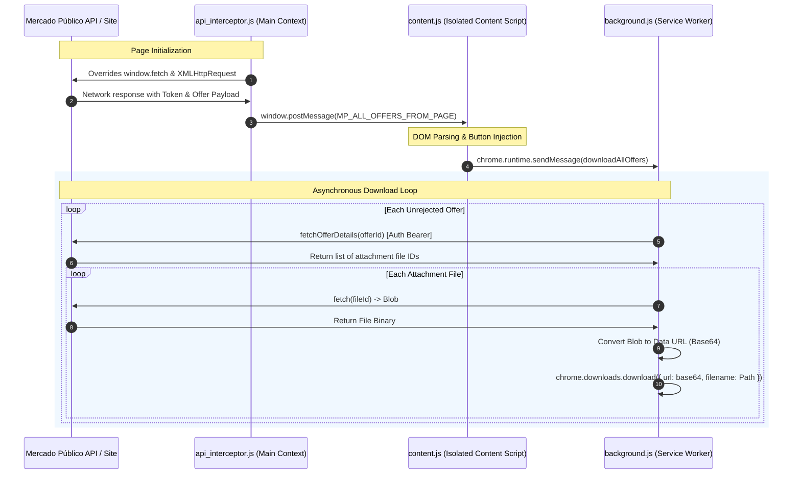

# 🤖 AI-Ready Architectural Reference: MP Tools (Mercado Público Automation)

This document is compiled specifically for Large Language Models (LLMs) and AI Assistants to quickly master the codebase, integration patterns, APIs, and quirks of the **MP Tools (Descarga Masiva de Adjuntos - Mercado Público)** browser extension.

---

## 📌 Context & Execution Environment

*   **Platform:** Google Chrome / Microsoft Edge Extension (Manifest V3).
*   **Target Domain:** `https://*.mercadopublico.cl/*` (Specifically focusing on the React-based **"Compra Ágil"** portal).
*   **Host Site Stack:** Single Page Application (SPA) built with **React** and styled via **Material UI (MUI)**.
*   **Permissions Requested:** `downloads` (for downloading files directly), `host_permissions` for `mercadopublico.cl`.

---

## 🏗️ Universal Architecture & Data Flow

The extension relies on a multi-layered execution model to bypass browser isolation policies (Content Script sandbox) and communicate with React's Virtual DOM.



---

## 🗄️ Comprehensive File Walkthrough & Technical Details

### 1. `manifest.json` (Extension Specification)
*   **Role:** Global declaration manifest.
*   **Context:** Extention Root.
*   **Key Declarations:**
    *   **Service Worker:** Declares `background.js` as an ES module (`"type": "module"`).
    *   **Content Scripts:** Injects `content.js`, `highlight_offers.js`, and `bulk_editor.js` into all subframes (`"all_frames": true`) of `mercadopublico.cl` at `document_end`.
    *   **Web Accessible Resources:** Exposes `api_interceptor.js` so it can be programmatically injected into the webpage's main execution context.
    *   **Permissions:** Requests `downloads` to bypass standard browser download prompt popups and orchestrate file management.

---

### 2. `api_interceptor.js` (Universal Request/Response Sniffer)
*   **Role:** Extracts active Authorization Bearer Tokens and raw API payload data.
*   **Context:** **Main Webpage Context** (Non-isolated; shares the same `window` scope as the page's React scripts).
*   **Why it's needed:** Content scripts run in an isolated execution sandbox where they cannot read headers of the page's active network connections or access the `window` variable directly.
*   **Mechanism of Action:**
    *   Saves references to native `window.fetch` and `XMLHttpRequest` prototype open/send methods.
    *   **Fetch Hooking:** Wraps `window.fetch`. When a URL containing `/v1/compra-agil/solicitud/` is processed, it clones the response (`response.clone()`), reads its text body, extracts the `Authorization` header, and parses the JSON.
    *   **XHR Hooking:** Wraps `XMLHttpRequest.prototype.open` to record URLs, and `setRequestHeader` to record headers in temporary properties (`_mp_url`, `_mp_headers`). Adds a listener to `readystatechange` (state 4, status 200) to grab the payload.
    *   **Communication:** Dispatches payloads to the content script using:
        ```javascript
        window.postMessage({ type: 'MP_DATA_FROM_PAGE' | 'MP_ALL_OFFERS_FROM_PAGE', payload: { ... } }, window.location.origin);
        ```

---

### 3. `content.js` (Core UI Injector & Orchestrator)
*   **Role:** Acts as the bridge between the page context and the extension's background runner.
*   **Context:** **Isolated Content Script**.
*   **Key Operations:**
    *   **Interceptor Injection:** Dynamically appends a `<script>` tag referencing `api_interceptor.js` to the page's `<head>`, executing it inside the main webpage context, then instantly cleans it up from the DOM.
    *   **PostMessage Listener:** Receives data packages sent via `window.postMessage` from the interceptor.
    *   **Button Injections:**
        *   Injects `📥 Descargar todo` (Individual offer attachments) by scraping for elements containing "Adjuntos de la cotización".
        *   Injects `📥 Descargar todas las ofertas` (Global bulk download button) adjacent to the calling phase indicator span (containing the word "Llamado").
        *   Injects `📊 Exportar tabla a Excel` (CSV export button) next to the bulk download button.
    *   **Download Filtering & Dispatching:**
        *   **Local Action:** Performs direct authenticated fetch and blob creation for individual offers.
        *   **Bulk Action:** Filters out any offer whose UI card contains the text element `INADMISIBLE`.
        *   Sends the sanitized, clean list of target offer JSON items + the authorization bearer token to the background service worker using `chrome.runtime.sendMessage`.
    *   **Progress Listener:** Listens for `downloadProgress` messages from the background worker and updates the bulk-download button text in real time (`⏳ Descargando oferta X/Y (N archivos)...`).
    *   **Offer Data Export (`handleExportOffersExcel`):** Scrapes every `.MuiPaper-root` offer card (identified by the presence of an `a[href*="proveedor.mercadopublico.cl/ficha"]` anchor), extracts provider name, RUT (regex `\b\d{1,2}\.\d{3}\.\d{3}-[0-9Kk]\b`), vigencia, total price (`h3` containing `$`), description, and inadmissibility status, then generates a semicolon-delimited CSV with a UTF-8 BOM (`\ufeff`) and triggers a download named `Ofertas_{QuotaCode}.csv`.

---

### 4. `background.js` (High-Volume Asynchronous Downloader)
*   **Role:** Operates as a persistent service worker capable of running complex fetch lists outside the scope of individual page lifecycles.
*   **Context:** **Extension Service Worker**.
*   **Key Operations & Implementation:**
    *   **Message Listener:** Listens for `downloadAllOffers` action. Forwards the `sender` object (containing the originating tab ID) into the download handler so progress can be reported back.
    *   **File Resolution Loop (`handleAllOffersDownload`):**
        1. Iterates over the raw list of filtered offers.
        2. Before processing each offer, sends a `downloadProgress` message to the sender tab (`chrome.tabs.sendMessage`) with the current offer index, total offers, and running file count.
        3. Queries the Mercado Público API `.../solicitud/cotizacion/{ofertaId}` to resolve the actual database file attachments (`documentosAdjuntos`).
        4. For each file ID, issues an authenticated request to download the raw binary blob.
        5. Converts the blob to a base64 Data URL via a `FileReader` reader interface.
        6. Triggers `chrome.downloads.download` using the base64 payload.
        7. Resolves the promise with the total count of downloaded files, which is relayed back to the content script in the response payload.
    *   **Rate Limiting & Safety:** Implements a strict `500ms` promise delay between consecutive file downloads to prevent browser bottlenecks and avoid rate-limiting triggers.
    *   **Filename Sanitization:** Recursively replaces unsafe operating system naming characters (e.g. `< > : " / \ | ? * \x00-\x1F`) with underscores (`_`) using:
        ```javascript
        name.replace(/[<>:"/\\|?*\x00-\x1F]/g, '_').trim();
        ```
    *   **File Conflict Action:** Uses `conflictAction: 'uniquify'` to ensure duplicate files don't block downloads.

---

### 5. `bulk_editor.js` (Form Automation & React State Hydrator)
*   **Role:** Pastes datasets directly from Excel spreadsheets into React forms.
*   **Context:** **Isolated Content Script**.
*   **Technical Deep-Dive (Bypassing the Virtual DOM):**
    *   **The Problem:** Simply modifying `input.value = "newValue"` in standard HTML works visually, but React's internal state tracker fails to detect the value shift. Upon clicking "Save", the fields reset to their original state.
    *   **The Hack (`setReactInputValue`):**
        ```javascript
        function setReactInputValue(element, value) {
            if (!element) return;
            const lastValue = element.value;
            element.value = value;
            const tracker = element._valueTracker;
            if (tracker) {
                tracker.setValue(lastValue); // Syncs React's internal value tracker
            }
            element.dispatchEvent(new Event('input', { bubbles: true }));
            element.dispatchEvent(new Event('change', { bubbles: true }));
            element.dispatchEvent(new Event('blur', { bubbles: true }));
        }
        ```
    *   **MUI Dropdown Simulation (`selectMuiDropdown`):**
        Material UI hides options in overlaying dropdown portals. The script handles this by:
        1. Dispatching low-level custom `MouseEvent` clicks (`mousedown`, `mouseup`, `click`) directly on the combobox trigger.
        2. Halting execution for `800ms` to allow the DOM node to render the portal container list.
        3. Scanning the newly rendered options (`li[role="option"]`) for matching text or title attributes.
        4. Executing simulated clicks on the matched option, or clicking the backdrop overlay if no option fits, closing the portal.

---

### 6. `highlight_offers.js` (Budget Intelligence & Auto-Reject State Machine)
*   **Role:** Highlights over-budget offers and handles automated rejection steps.
*   **Context:** **Isolated Content Script**.
*   **Key Operations:**
    *   **DOM Scraping:** Traverses the page to extract "Presupuesto estimado" (Estimated Budget) and "Tipo de presupuesto" (Budget Type: "Disponible" vs "Estimado").
    *   **Budget Type Evaluation Logic:**
        *   If **Disponible** (Available): Any offer exceeding the strict limit is highlighted in red (`rgba(255, 0, 0, 0.08)`) with a custom error text.
        *   If **Estimado** (Estimated): Any offer exceeding **130%** of the budget is highlighted in yellow (`rgba(255, 193, 7, 0.1)`).
    *   **Asynchronous Auto-Reject Engine:**
        If a red offer is identified, the script appends a `🤖 Auto-Rechazar` button. Clicking it fires an automated asynchronous state machine:
        ```mermaid
        stateDiagram-v2
            [*] --> Step1: Click "Declarar inadmisible"
            Step1 --> Step2: Wait for modal and click Radio Option 2 (Out of Budget)
            Step2 --> Step3: Click confirmation "Declarar inadmisible" inside modal
            Step3 --> Step4: MutationObserver waits for warning alert modal to render
            Step4 --> Step5: Click final "Continuar y declarar" confirmation
            Step5 --> [*]: Completion & UI cleanup
        ```
        This engine implements a `MutationObserver`-powered `waitForElement` promise to handle variable network lag during transitions securely without hardcoded `setTimeout` values.

---

## 📡 Message Bus & Inter-Script Communication Details

Here are the precise message payloads used for internal communication:

### 1. Injected Script to Content Script
*   **Method:** `window.postMessage(payload, window.location.origin)`
*   **Type:** `MP_DATA_FROM_PAGE`
    ```json
    {
      "type": "MP_DATA_FROM_PAGE",
      "payload": {
        "files": [{"id": "12345", "filename": "spec.pdf"}],
        "token": "Bearer eyJhbGciOi..."
      }
    }
    ```
*   **Type:** `MP_ALL_OFFERS_FROM_PAGE`
    ```json
    {
      "type": "MP_ALL_OFFERS_FROM_PAGE",
      "payload": {
        "ofertas": [{"id": 98765, "razonSocial": "Proveedor S.A."}],
        "token": "Bearer eyJhbGciOi..."
      }
    }
    ```

### 2. Content Script to Background Worker
*   **Method:** `chrome.runtime.sendMessage(payload, callback)`
*   **Type:** `downloadAllOffers`
    ```json
    {
      "action": "downloadAllOffers",
      "ofertas": [{"id": 98765, "razonSocial": "Proveedor S.A."}],
      "token": "Bearer eyJhbGciOi...",
      "rootFolder": "2284-145-COT26"
    }
    ```

### 3. Background Worker to Content Script (Progress Updates)
*   **Method:** `chrome.tabs.sendMessage(senderTabId, payload)`
*   **Type:** `downloadProgress`
    ```json
    {
      "action": "downloadProgress",
      "currentOffer": 3,
      "totalOffers": 10,
      "filesDownloaded": 12
    }
    ```
*   **Response (on completion):** The `downloadAllOffers` callback receives `{ "success": true, "totalDownloaded": 47 }`, which the content script uses to populate the completion modal.

---

## 🎯 Selector Reference Sheet

Keep these standard Material UI selector hooks in mind when reading or editing the DOM scraper:
*   **Offer Cards:** `.MuiPaper-root` (Filtered down to components that contain specific headers/prices).
*   **Product Input Cards:** `.MuiPaper-root` (Filtered by checking for child elements matching `input[type="number"]` and `[role="combobox"]`).
*   **Text Areas:** `textarea` (Filtering out hidden fields by evaluating `aria-hidden !== 'true'`).
*   **Combo Triggers:** `[role="combobox"]` or `input[type="radio"][value="2"]` for budget rejection.
*   **MUI Dropdown Option Items:** `li[role="option"]` and `.MuiPopover-root div[aria-hidden="true"]` (backdrop).
*   **Quotation IDs:** Extracted from the main `<h2>` using the regex: `/\d+-\d+-[A-Z0-9]+/`.
*   **Offer Card Identification (Export):** `a[href*="proveedor.mercadopublico.cl/ficha"]` anchors distinguish offer cards from other `.MuiPaper-root` elements.
*   **Provider RUT (Export):** Matched via regex `\b\d{1,2}\.\d{3}\.\d{3}-[0-9Kk]\b` against the card's `innerHTML`.
*   **Offer Price (Export):** The `h3` element containing a `$` symbol within an offer card.
*   **Inadmissibility Status (Export/Filter):** Any `span`, `div`, or `p` whose trimmed `textContent` equals exactly `INADMISIBLE`.
