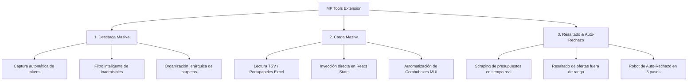

# 📥 Herramientas para Mercado Público (MP Tools) v4.1.1

Una potente y sofisticada extensión de Chrome diseñada para optimizar, automatizar y agilizar tareas críticas dentro del portal de [Mercado Público](https://www.mercadopublico.cl/), específicamente en el módulo de **Compra Ágil**. Esta herramienta agrupa tres funcionalidades clave en una única solución integrada que ahorra horas de trabajo manual.

---

## 🎯 Pilares y Funcionalidades Clave

### 1. 📂 Descarga Masiva de Adjuntos
Agrega botones automatizados para descargar archivos y ofertas de forma masiva y organizada.
* **Descarga de Oferta Individual**: Obtiene todos los documentos vinculados a una cotización específica con un solo clic.
* **Descarga Masiva de Todas las Ofertas**: Agrega un botón global `Descargar todas las ofertas` al lado del indicador de llamado.
* **Organización Dinámica e Inteligente**: Crea carpetas ordenadas automáticamente en tu directorio de descargas:
  $$\text{Ruta: }\texttt{Downloads/\{Código\_Cotización\}/\{Razón\_Social\_Proveedor\}/\{Nombre\_Archivo\}}$$
  *(Ejemplo: `Downloads/2284-145-COT26/Proveedor_SPA/ficha_tecnica.pdf`)*
* **Filtro Avanzado de Inadmisibilidad**: La descarga masiva omite automáticamente aquellas ofertas que hayan sido declaradas como **INADMISIBLE** (ya sea de forma manual o mediante el robot de auto-rechazo), ahorrando ancho de banda y almacenamiento.
* **Feedback Visual Inmediato**: Un modal informativo emergente avisa al usuario una vez que el proceso masivo ha concluido con éxito.

### 2. 📋 Carga Masiva desde Excel
Permite copiar filas y columnas con datos de productos o cotizaciones desde Microsoft Excel o Google Sheets y pegarlas directamente en los formularios web de Mercado Público.
* **Compatibilidad Estricta**: Soporta formatos delimitados por tabulaciones (TSV) y punto y coma (`;`).
* **Sincronización con el State de React**: Rompe la barrera del DOM virtual actualizando el `_valueTracker` interno de React para asegurar que los cambios se guarden y procesen correctamente.
* **Mapeo Inteligente de Campos**: Rellena automáticamente campos de cantidad (`input[type="number"]`), detalle (`textarea`) y selecciona la unidad de medida interactuando con los complejos componentes `MuiPopover` y `combobox` de Material UI.
* **Plantilla Lista para Usar**: Incluye un enlace de descarga directa a una plantilla oficial en la nube para garantizar una carga libre de errores.

### 3. 🤖 Automatización y Resaltado Inteligente de Ofertas
Analiza el presupuesto oficial cargado en la ficha y evalúa cada oferta económica recibida en tiempo real de manera autónoma.
* **Detección Automática**: Identifica el monto de presupuesto estimado o disponible y el tipo de presupuesto establecido por el organismo público.
* **Semáforo de Alertas Visuales**:
  * 🔴 **Rojo (Presupuesto Disponible Excedido)**: Ofertas que superan el presupuesto límite de compra. Inyecta una etiqueta de advertencia y habilita el botón de auto-descarte.
  * 🟡 **Amarillo (Presupuesto Estimado Excedido)**: Ofertas que superan en un 30% el valor estimado de referencia.
* **Robot de Auto-Rechazo (Flujo Asíncrono de 5 Pasos)**:
  1. Activa el flujo haciendo clic en `🤖 Auto-Rechazar` en la tarjeta marcada.
  2. Selecciona automáticamente la causal de rechazo por presupuesto.
  3. Confirma la primera ventana modal de descarte.
  4. Monitorea y espera la aparición de la advertencia irreversible mediante un `MutationObserver`.
  5. Realiza la confirmación final del descarte, todo en menos de 2 segundos de forma segura.

---

## 🛠️ Arquitectura del Proyecto

El desarrollo se rige bajo una arquitectura modular y reactiva optimizada para Manifest V3 de Chrome:

| Archivo | Contexto | Responsabilidad Principal |
| :--- | :--- | :--- |
| **[`manifest.json`](file:///c:/Users/Dante/Desktop/plugins/Microsoft%20Store/mp_descargas/manifest.json)** | Extensión | Configuración global, permisos de descargas, inyección y declaración de recursos. |
| **[`api_interceptor.js`](file:///c:/Users/Dante/Desktop/plugins/Microsoft%20Store/mp_descargas/api_interceptor.js)** | Página Principal | Intercepta `window.fetch` y `XMLHttpRequest` para extraer payloads y tokens de portación (`Authorization`). |
| **[`content.js`](file:///c:/Users/Dante/Desktop/plugins/Microsoft%20Store/mp_descargas/content.js)** | Script de Contenido | Funciona como puente. Inyecta elementos UI de descarga y canaliza los tokens al Background. |
| **[`background.js`](file:///c:/Users/Dante/Desktop/plugins/Microsoft%20Store/mp_descargas/background.js)** | Service Worker | Orquesta la descarga asíncrona concurrente de archivos pesados respetando límites de tasa (rate-limiting). |
| **[`bulk_editor.js`](file:///c:/Users/Dante/Desktop/plugins/Microsoft%20Store/mp_descargas/bulk_editor.js)** | Script de Contenido | Procesa el portapapeles y ejecuta la simulación de entrada e interacciones en formularios React. |
| **[`highlight_offers.js`](file:///c:/Users/Dante/Desktop/plugins/Microsoft%20Store/mp_descargas/highlight_offers.js)** | Script de Contenido | Analiza el DOM, evalúa reglas de presupuesto, colorea la interfaz e impulsa el robot de descarte. |

---

## 📦 Instalación (Modo Desarrollador)

1. Descarga o clona este repositorio en tu máquina local.
2. Abre Google Chrome o Microsoft Edge y dirígete al panel de administración de extensiones:
   * Chrome: `chrome://extensions/`
   * Edge: `edge://extensions/`
3. Activa el interruptor de **"Modo desarrollador"** (Developer Mode) en la esquina superior derecha.
4. Presiona el botón **"Cargar descomprimida"** (Load unpacked).
5. Selecciona la carpeta raíz del proyecto (`mp_descargas`).
6. ¡Listo! La extensión se activará automáticamente al navegar por Mercado Público.

---

## 🚀 Guía Rápida de Uso

> [!IMPORTANT]
> Para el correcto funcionamiento de la descarga masiva, la extensión requiere que el usuario haya iniciado sesión en Mercado Público. Los tokens se capturan dinámicamente de forma automática en el primer request que la página realiza a las APIs oficiales del portal.

### 📥 Descarga Masiva
1. Ve a la ficha de ofertas o al módulo de adjuntos de cualquier cotización.
2. La extensión detectará los adjuntos y pintará un botón azul con el texto **`📥 Descargar todo`** o **`📥 Descargar todas las ofertas`**.
3. Haz clic y observa cómo se descargan los archivos en subcarpetas de manera estructurada.

### 📋 Carga Masiva (Excel)
1. Presiona el botón flotante superior derecho **`📋 Carga Masiva`**.
2. Copia tus datos directamente desde Excel usando la plantilla oficial.
3. Pega los datos en la caja de texto y haz clic en **`⚡ Ejecutar Carga`**.

### 🤖 Resaltado y Auto-Rechazo
* No requiere acción del usuario. Se ejecuta de fondo en las pantallas de Cuadros Comparativos.
* Si una oferta excede el presupuesto disponible y requiere rechazo, haz clic en **`🤖 Auto-Rechazar`** para descartar la oferta en segundos con la causal correcta de manera automatizada.

---

## 🔒 Privacidad y Seguridad

* **Ejecución 100% Local**: La extensión no recopila, procesa ni envía datos a servidores externos. Todo el procesamiento y las descargas ocurren estrictamente dentro de tu navegador web.
* **Seguridad de Credenciales**: No se almacenan claves, cookies ni tokens persistentes. El token de autorización (`Authorization: Bearer ...`) es temporal, reside únicamente en memoria y se autodestruye al cerrar o refrescar la pestaña.
* **Aislamiento de Contexto**: La extensión solo tiene permisos activos en el dominio oficial `*.mercadopublico.cl`.

---

*Desarrollado profesionalmente para agilizar la gestión operativa en Mercado Público del Estado de Chile.*
