# 📥 MP Tools para Mercado Público (Compra Ágil) v4.3.5

Una potente y sofisticada extensión de **Chrome / Edge** diseñada para optimizar, automatizar y agilizar tareas críticas dentro del portal de [Mercado Público](https://www.mercadopublico.cl/), específicamente en el módulo de **Compra Ágil** y ahora también en el portal legacy de **Licitaciones (Voucher View)**. Esta herramienta agrupa cinco funcionalidades clave en una única solución integrada que ahorra horas de trabajo manual.

> ✅ **100% compatible con Google Chrome y Microsoft Edge** (Manifest V3). Ver [`COMPATIBILIDAD.md`](COMPATIBILIDAD.md) para el análisis detallado.

---

## 🎯 Pilares y Funcionalidades Clave

```mermaid
graph TD
    A[MP Tools Extension] --> B[1. Descarga Masiva Compra Ágil]
    A --> C[2. Carga Masiva]
    A --> D[3. Resaltado & Auto-Rechazo]
    A --> E[4. Exportación de Ofertas]
    A --> F[5. Descarga Masiva Licitaciones]

    B --> B1[Captura automática de tokens]
    B --> B2[Filtro inteligente de Inadmisibles]
    B --> B3[Organización jerárquica de carpetas]
    B --> B4[Progreso de descarga en tiempo real]

    C --> C1[Lectura TSV / Portapapeles Excel]
    C --> C2[Inyección directa en React State]
    C --> C3[Automatización de Comboboxes MUI]

    D --> D1[Scraping de presupuestos en tiempo real]
    D --> D2[Resaltado de ofertas fuera de rango]
    D --> D3[Robot de Auto-Rechazo en 5 pasos]

    E --> E1[Extracción de datos de cada oferta]
    E --> E2[Exportación a CSV compatible con Excel]
    E --> E3[BOM UTF-8 para acentos correctos]

    F --> F1[Portal legacy ASP.NET WebForms]
    F --> F2[Replica del POST Ver Anexo sin captcha]
    F --> F3[Paginación automática con reanudación]
    F --> F4[Organización Licitacion_Codigo/Proveedor]
```

### 1. 📂 Descarga Masiva de Adjuntos (Compra Ágil)
Agrega botones automatizados para descargar archivos y ofertas de forma masiva y organizada.
* **Descarga de Oferta Individual**: Obtiene todos los documentos vinculados a una cotización específica con un solo clic mediante el botón `📥 Descargar todo`.
* **Descarga Masiva de Todas las Ofertas**: Agrega un botón global `📥 Descargar todas las ofertas` al lado del indicador de llamado.
* **Organización Dinámica e Inteligente**: Crea carpetas ordenadas automáticamente en tu directorio de descargas:
  $$\text{Ruta: }\texttt{Downloads/\{Código\_Cotización\}/\{Razón\_Social\_Proveedor\}/\{Nombre\_Archivo\}}$$
  *(Ejemplo: `Downloads/2284-145-COT26/Proveedor_SPA/ficha_tecnica.pdf`)*
* **Filtro Avanzado de Inadmisibilidad**: La descarga masiva omite automáticamente aquellas ofertas que hayan sido declaradas como **INADMISIBLE** (ya sea de forma manual o mediante el robot de auto-rechazo), ahorrando ancho de banda y almacenamiento.
* **Progreso en Tiempo Real**: Durante la descarga masiva, el botón muestra el avance en vivo (`⏳ Descargando oferta 3/10 (12 archivos)...`) y el modal final informa la cantidad exacta de archivos descargados.
* **Feedback Visual Inmediato**: Un modal informativo emergente avisa al usuario una vez que el proceso masivo ha concluido con éxito.

### 2. 📋 Carga Masiva desde Excel
Permite copiar filas y columnas con datos de productos o cotizaciones desde Microsoft Excel o Google Sheets y pegarlas directamente en los formularios web de Mercado Público.
* **Compatibilidad Estricta**: Soporta formatos delimitados por tabulaciones (TSV) y punto y coma (`;`).
* **Sincronización con el State de React**: Rompe la barrera del DOM virtual actualizando el `_valueTracker` interno de React para asegurar que los cambios se guarden y procesen correctamente.
* **Mapeo Inteligente de Campos**: Rellena automáticamente campos de cantidad (`input[type="number"]`), detalle (`textarea`) y selecciona la unidad de medida interactuando con los complejos componentes `MuiPopover` y `combobox` de Material UI.
* **Plantilla Lista para Usar**: Incluye un enlace de descarga directa a una plantilla oficial en la nube para garantizar una carga libre de errores.

### 3. 🤖 Automatización y Resaltado Inteligente de Ofertas
Analiza el presupuesto oficial cargado en la ficha y evalúa cada oferta económica recibida en tiempo real de manera autónoma.
* **Detección Automática**: Identifica el monto de presupuesto estimado o disponible y el tipo de presupuesto establecido por el organismo público.
* **Semáforo de Alertas Visuales**:
  * 🔴 **Rojo (Presupuesto Disponible Excedido)**: Ofertas que superan el presupuesto límite de compra. Inyecta una etiqueta de advertencia y habilita el botón de auto-descarte.
  * 🟡 **Amarillo (Presupuesto Estimado Excedido)**: Ofertas que superan en un 30% el valor estimado de referencia.
* **Robot de Auto-Rechazo (Flujo Asíncrono de 5 Pasos)**:
  1. Activa el flujo haciendo clic en `🤖 Auto-Rechazar` en la tarjeta marcada.
  2. Selecciona automáticamente la causal de rechazo por presupuesto.
  3. Confirma la primera ventana modal de descarte.
  4. Monitorea y espera la aparición de la advertencia irreversible mediante un `MutationObserver`.
  5. Realiza la confirmación final del descarte, todo en menos de 2 segundos de forma segura.

### 4. 📊 Exportación de Ofertas a Excel/CSV
Extrae y consolida automáticamente los datos de todas las ofertas visibles en el cuadro comparativo y los exporta a un archivo CSV listo para abrir en Microsoft Excel.
* **Botón Dedicado**: Se inyecta un botón verde `📊 Exportar tabla a Excel` junto al de descarga masiva.
* **Datos Capturados por Oferta**:
  * Razón Social del proveedor.
  * RUT (formato chileno `XX.XXX.XXX-X`).
  * Descripción de la oferta.
  * Vigencia de la oferta.
  * Monto total.
  * Estado de inadmisibilidad (`SÍ` / `NO`).
* **Compatibilidad Total con Excel**: Genera un archivo delimitado por punto y coma (`;`) con marca de orden de bytes UTF-8 (BOM) para garantizar que los acentos y caracteres especiales se visualicen correctamente al abrirlo.
* **Naming Automático**: El archivo se nombra automáticamente con el código de cotización (ej. `Ofertas_2284-145-COT26.csv`).

### 5. 🏛️ Descarga Masiva de Adjuntos en Licitaciones (Voucher View) — *NUEVO*
Extiende la capacidad de descarga masiva al portal legacy de **Licitaciones** (`voucherview.aspx`, ASP.NET WebForms), independiente del módulo Compra Ágil.
* **Botón dedicado por oferta**: Inyecta un botón `📥` junto a cada "Ver Comprobante de oferta" en la grilla de Resumen de Ofertas (`grdSupplies`), incluso si vive dentro de iframes anidados del mismo origen.
* **Inyección multi-frame confiable**: El **popup de la extensión** inyecta el script en *todos* los frames de la pestaña activa mediante `chrome.scripting.executeScript({ allFrames: true })`, alcanzando la grilla aunque se encuentre en un iframe anidado.
* **Replica del POST "Ver Anexo" sin captcha**: El service worker reconstruye el body `application/x-www-form-urlencoded` con todos los campos ocultos del formulario (`__VIEWSTATE`, `__VIEWSTATEGENERATOR`, …) más las coordenadas del botón de fila (`<buttonName>.x=1&<buttonName>.y=1`). Las cookies de sesión viajan automáticamente (`credentials: 'include'`).
* **Paginación automática con reanudación**: Avanza página por página y guarda el estado en `sessionStorage`, lo que lo hace robusto ante postbacks completos (recarga de página) y postbacks parciales (`UpdatePanel`).
* **Organización por proveedor**: Guarda cada adjunto en `Descargas/Licitacion_<código>/<proveedor>/<archivo>`.

---

## 🛠️ Arquitectura del Proyecto

El desarrollo se rige bajo una arquitectura modular y reactiva optimizada para **Manifest V3** de Chrome/Edge:

| Archivo | Contexto | Responsabilidad Principal |
| :--- | :--- | :--- |
| **[`manifest.json`](manifest.json)** | Extensión | Configuración global, permisos (`downloads`, `scripting`), inyección de content scripts y declaración de recursos accesibles. |
| **[`popup.html`](popup.html)** / **[`popup.js`](popup.js)** | UI Popup | Ventana emergente de la extensión. Inyecta `licitaciones_download.js` en todos los frames del tab activo y reporta cuántos botones `📥` se crearon. |
| **[`api_interceptor.js`](api_interceptor.js)** | Página Principal | Intercepta `window.fetch` y `XMLHttpRequest` para extraer payloads y tokens de portación (`Authorization`). |
| **[`content.js`](content.js)** | Script de Contenido | Funciona como puente. Inyecta elementos UI de descarga/exportación y canaliza los tokens al Background (Compra Ágil). |
| **[`background.js`](background.js)** | Service Worker | Orquesta la descarga asíncrona concurrente de archivos pesados respetando límites de tasa (rate-limiting) y reporta progreso. Importa `voucher_background.js`. |
| **[`bulk_editor.js`](bulk_editor.js)** | Script de Contenido | Procesa el portapapeles y ejecuta la simulación de entrada e interacciones en formularios React. |
| **[`highlight_offers.js`](highlight_offers.js)** | Script de Contenido | Analiza el DOM, evalúa reglas de presupuesto, colorea la interfaz e impulsa el robot de descarte. |
| **[`voucher_content.js`](voucher_content.js)** | Script de Contenido | Descarga masiva de adjuntos en **Licitaciones** (Voucher View). Detecta la grilla, inyecta el botón global y coordina la paginación. |
| **[`voucher_background.js`](voucher_background.js)** | Service Worker (ES module) | Replica el POST "Ver Anexo" (captcha-free) y guarda cada blob con `chrome.downloads.download`. |
| **[`licitaciones_download.js`](licitaciones_download.js)** | Script de Contenido / Popup | Recorre iframes del mismo origen, localiza la grilla `grdSupplies` e inyecta `📥` junto a cada comprobante de oferta. |

---

## 📦 Instalación

### Desde la Chrome Web Store / Microsoft Edge Add-ons
Basta con buscar **"MP Tools Mercado Público"** en la tienda de extensiones de tu navegador e instalarla. La extensión se activará automáticamente al navegar por Mercado Público.

### Modo Desarrollador (carga local)
1. Descarga o clona este repositorio en tu máquina local.
2. Abre Google Chrome o Microsoft Edge y dirígete al panel de administración de extensiones:
   * Chrome: `chrome://extensions/`
   * Edge: `edge://extensions/`
3. Activa el interruptor de **"Modo desarrollador"** (Developer Mode) en la esquina superior derecha.
4. Presiona el botón **"Cargar descomprimida"** (Load unpacked).
5. Selecciona la carpeta raíz del proyecto (`mp_descargas`).
6. ¡Listo! La extensión se activará automáticamente al navegar por Mercado Público.

---

## 🚀 Guía Rápida de Uso

> [!IMPORTANT]
> Para el correcto funcionamiento de la descarga masiva, la extensión requiere que el usuario haya iniciado sesión en Mercado Público. Los tokens se capturan dinámicamente de forma automática en el primer request que la página realiza a las APIs oficiales del portal.

### 📥 Descarga Masiva (Compra Ágil)
1. Ve a la ficha de ofertas o al módulo de adjuntos de cualquier cotización.
2. La extensión detectará los adjuntos y pintará un botón azul con el texto **`📥 Descargar todo`** (oferta individual) o **`📥 Descargar todas las ofertas`** (todas las ofertas del llamado).
3. Haz clic y observa cómo se descargan los archivos en subcarpetas de manera estructurada. El botón mostrará el progreso en tiempo real.

### 📋 Carga Masiva (Excel)
1. Presiona el botón flotante superior derecho **`📋 Carga Masiva`**.
2. Copia tus datos directamente desde Excel usando la plantilla oficial.
3. Pega los datos en la caja de texto y haz clic en **`⚡ Ejecutar Carga`**.

### 📊 Exportación de Ofertas
1. En la pantalla del cuadro comparativo de ofertas, busca el botón verde **`📊 Exportar tabla a Excel`** (junto al botón de descarga masiva).
2. Haz clic y el archivo CSV se descargará automáticamente con todos los datos de las ofertas.

### 🤖 Resaltado y Auto-Rechazo
* No requiere acción del usuario. Se ejecuta de fondo en las pantallas de Cuadros Comparativos.
* Si una oferta excede el presupuesto disponible y requiere rechazo, haz clic en **`🤖 Auto-Rechazar`** para descartar la oferta en segundos con la causal correcta de manera automatizada.

### 🏛️ Descarga Masiva en Licitaciones (Voucher View)
1. Abre el **Resumen de ofertas** de una Licitación en Mercado Público.
2. Haz clic en el ícono de la extensión (toolbar) y presiona **`🔄 Inyectar botones de descarga`**.
3. Aparecerá un botón `📥` junto a cada oferta de la grilla `grdSupplies`.
4. Pulsa `📥` en la oferta deseada para descargar **todos** sus adjuntos (todas las páginas) en `Descargas/Licitacion_<código>/<proveedor>/`.

---

## 🔒 Privacidad y Seguridad

* **Ejecución 100% Local**: La extensión no recopila, procesa ni envía datos a servidores externos. Todo el procesamiento y las descargas ocurren estrictamente dentro de tu navegador web.
* **Seguridad de Credenciales**: No se almacenan claves, cookies ni tokens persistentes. El token de autorización (`Authorization: Bearer ...`) es temporal, reside únicamente en memoria y se autodestruye al cerrar o refrescar la pestaña.
* **Aislamiento de Contexto**: La extensión solo tiene permisos activos en el dominio oficial `*.mercadopublico.cl`.

---

## 🌐 Compatibilidad de Navegadores

La extensión está construida sobre **Manifest V3** y utiliza únicamente APIs estándar del ecosistema Chromium (`chrome.*`), por lo que es **totalmente compatible** con:

| Navegador | Estado | Notas |
| :--- | :--- | :--- |
| **Google Chrome** | ✅ Compatible | Plataforma de referencia (Manifest V3 nativo). |
| **Microsoft Edge** | ✅ Compatible | Basado en Chromium; las APIs `chrome.downloads`, `chrome.scripting`, service worker tipo módulo y `all_frames` funcionan idénticamente. |

> El análisis completo API por API está disponible en [`COMPATIBILIDAD.md`](COMPATIBILIDAD.md).

---

## 📝 Registro de Cambios (Changelog)

### v4.3.5
* ✨ **Nuevo módulo**: Descarga masiva de adjuntos para **Licitaciones (Voucher View)** mediante replica del POST "Ver Anexo" (captcha-free) y paginación automática con reanudación vía `sessionStorage`.
* ✨ **Nuevo**: Popup de la extensión (`popup.html` / `popup.js`) que inyecta el script de Licitaciones en todos los frames del tab activo con un solo clic.
* 🛠️ **Arquitectura**: `background.js` ahora es importador de `voucher_background.js` (handler `downloadVoucherFiles`). Se agrega el permiso `scripting`.
* 🛠️ **Mejora**: Recorrido recursivo de iframes del mismo origen para localizar la grilla `grdSupplies` y los comprobantes de oferta.

### v4.2.0
* ✨ **Nuevo**: Exportación de ofertas a Excel/CSV (`📊 Exportar tabla a Excel`) con datos completos de proveedor, RUT, vigencia, monto e inadmisibilidad.
* ✨ **Nuevo**: Indicador de progreso de descarga en tiempo real durante la descarga masiva.
* ✨ **Nuevo**: El modal de finalización ahora reporta la cantidad exacta de archivos descargados.
* 🐛 **Corregido**: Se restauró la inyección del botón `📥 Descargar todo` (descarga individual de adjuntos) que estaba roto por una función faltante.
* 🛠️ **Mejora**: Reporte de progreso bidireccional entre el Service Worker y el script de contenido.

### v4.1.1
* Filtro automático de ofertas INADMISIBLES en la descarga masiva.
* Modal de finalización de descargas.

### v4.1.0
* Robot de Auto-Rechazo asíncrono de 5 pasos.
* Resaltado de ofertas según tipo de presupuesto (Disponible/Estimado).

---

*Desarrollado profesionalmente para agilizar la gestión operativa en Mercado Público del Estado de Chile.*
