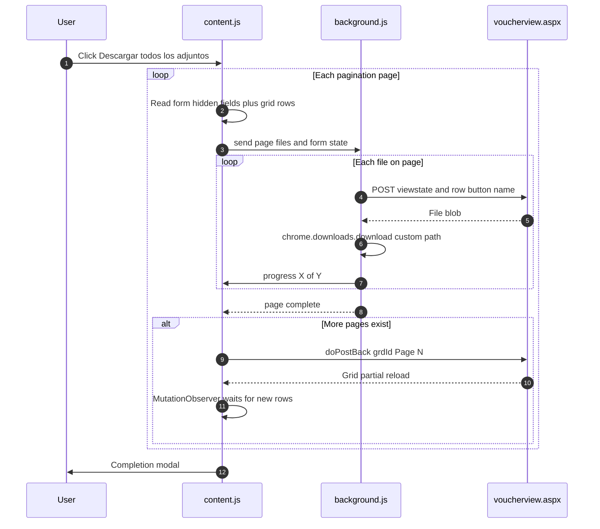
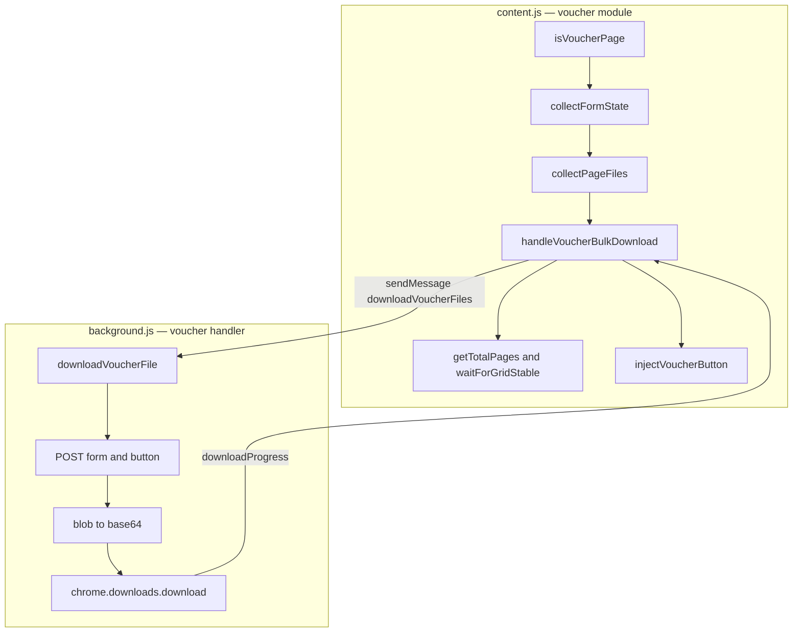

# Plan: Descarga Masiva de Adjuntos — Licitaciones (Voucher View)

> **Status:** Approved — pending implementation
> **Target module:** Legacy ASP.NET portal `voucherview.aspx` (Licitaciones / RFB)
> **Extension:** MP Tools (Manifest V3) — `mp_descargas`

---

## 1. Goal

Add a **"📥 Descargar todos los adjuntos"** button inside the licitaciones **voucher popup** (`voucherview.aspx`) that downloads every attachment across all pagination pages — **one by one, captcha-free** — mirroring the spirit of the existing Compra Ágil bulk-download feature, but adapted to the legacy ASP.NET WebForms architecture.

---

## 2. Context: Two Different Systems

The extension currently targets **Compra Ágil** (a React SPA with a clean JSON API). The **licitaciones** module is a **completely different, legacy system**:

| Aspect | Compra Ágil (current) | Licitaciones (new) |
|---|---|---|
| Stack | React SPA | ASP.NET WebForms (`.aspx`) |
| Data source | JSON REST API | Server-rendered grid + form POSTbacks |
| Auth | Bearer token (intercepted) | Cookies (automatic) |
| Page that lists files | React offer cards | `voucherview.aspx` grid `grdId` |
| Download mechanism | `GET` with `Authorization` header | `POST` form with `__VIEWSTATE` + row button |
| Captcha | None | Only on the **batch** button; **individual downloads are free** |

The extension already runs inside the voucher popup because [`manifest.json`](../manifest.json:17) matches `https://*.mercadopublico.cl/*` with `all_frames: true`. So [`content.js`](../content.js:2) is already injected there — it just needs to recognize the page.

---

## 3. Discovery Findings (verified)

### 3.1 The voucher popup

- **URL pattern:** `https://www.mercadopublico.cl/bid/modules/bid/voucherview.aspx?enc=<ENCRYPTED>`
- The `enc=` query parameter is an encrypted identifier (do not attempt to decode it; pass it through).
- It is a **popup window** opened from the licitación workflow.

### 3.2 The file grid

- **Grid element:** `<table id="UcVoucherView1_DWNL_grdId">` (selector: `table[id*="grdId"]`)
- **Rows per page:** 6 (confirmed)
- **Pagination:** up to 5 pages; pagination links are `javascript:__doPostBack('UcVoucherView1$DWNL$grdId','Page$N')`
- Each data row contains:
  - A filename (visible text)
  - A **"Ver Anexo" image button**: `<input type="image" name="UcVoucherView1$DWNL$grdId$ctlNN$search" src=".../ver.gif">`
  - Confirmed button names: `ctl02$search` … `ctl07$search` (one per row)

### 3.3 The captcha-free download mechanism

Clicking **"Ver Anexo"** triggers a **POST back to `voucherview.aspx?enc=…`** with:

- All hidden form fields (`__VIEWSTATE`, `__VIEWSTATEGENERATOR`, etc.)
- The clicked button's coordinates: `UcVoucherView1$DWNL$grdId$ctlNN$search.x=1&…search.y=1`

The server responds with the **file blob** (a direct download). The page does **not navigate away** — so multiple sequential downloads are possible.

> **Confirmed by user testing:** clicking "Ver Anexo" downloads the file directly; nothing new opens; the page stays intact.

### 3.4 The captcha (to avoid)

The **"Descargar seleccionados"** batch button (`DownLoadFile` validation group, `mensajeAlerta(...)` with 10 MB / 300 MB warnings) is the **only** captcha-gated path. We ignore it entirely.

### 3.5 Endpoint that did NOT work

`POST https://www.mercadopublico.cl/AddAttachment/Attachment/GetAllDocsAgregados` returns an **empty array `[]`**. Not usable — the real file list comes from the grid DOM, not this endpoint.

### 3.6 Sample decoded grid data

| File ID | GUID | Filename |
|---|---|---|
| 410922283 | 5C2F7291-DBA9-47D7-A7F8-1CAFE5FBDBBD | CV_DANIELAORELLANAGUEDENEY.pdf |
| 410922236 | 3722322A-AB62-458F-8703-0B97C655064B | CI DOG.pdf |
| 410922198 | BADE7B59-594A-4315-A621-ADC23ED8C52A | Certificado Título Pregrado….pdf |
| 410922152 | BED3A72C-050A-475C-8D2F-AD5C2F16EB60 | Certificado Título Postgrado….pdf |
| 410922118 | D86A327B-3E7F-4611-882E-0D36F254FFD7 | CARTA RED MAULE ORIGINAL….pdf |
| 410921960 | 19D21375-F040-4589-95D4-A80A938C251F | 1238167-89-AG25 Levantamiento sanitario.pdf |

---

## 4. Chosen Approach: Background-Fetch with VIEWSTATE

**Decision:** Replicate the "Ver Anexo" POST from the background service worker, rather than clicking buttons in-page.

**Rationale:**
1. **Organized naming** — files save as `Licitacion_2284-27-L126/<filename>.pdf`, consistent with the existing plugin's subfolder structure and avoiding collisions when the same filename recurs across offers.
2. **Reliability** — no `__EVENTVALIDATION` was observed in the captured form data, so resending the hidden fields is dependable.
3. **Reuses existing architecture** — the base64 → `chrome.downloads.download` loop in [`background.js`](../background.js:46) maps directly.

**Rejected alternative — sequential in-page clicking:** simpler, but files save with original names to the Downloads folder (no subfolders, collision-prone). Kept as a fallback if the POST approach proves unreliable.

---

## 5. Architecture

### 5.1 End-to-end flow



### 5.2 Component responsibilities



---

## 6. File-by-File Changes

### 6.1 `content.js` — add a parallel voucher module

The existing IIFE handles Compra Ágil. The voucher logic runs independently inside the same IIFE (it self-detects the page and no-ops otherwise).

#### 6.1.1 Config additions

```javascript
voucher: {
    selectors: {
        grid: 'table[id*="grdId"]',
        verAnexoButton: 'input[type="image"][src*="ver"]',
        form: 'form#form1, form[name="form1"]',
        paginationLink: 'a[href*="Page$"]'
    },
    ids: {
        voucherButton: 'mp-voucher-bulk-download'
    },
    texts: {
        voucherButtonInitial: '📥 Descargar todos los adjuntos',
        voucherButtonDownloading: '⏳ Descargando adjuntos...',
        voucherButtonDone: '✅ Completado',
        voucherButtonError: '❌ Error'
    },
    delays: {
        gridStableTimeout: 8000,
        betweenPages: 1500
    }
}
```

#### 6.1.2 Detection

```javascript
function isVoucherPage() {
    return location.href.includes('voucherview.aspx')
        && document.querySelector(CONFIG.voucher.selectors.grid) !== null;
}
```

#### 6.1.3 Collect form state (ALL hidden fields — robust against added fields)

```javascript
function collectFormState() {
    const form = document.querySelector(CONFIG.voucher.selectors.form);
    if (!form) return null;
    const state = {};
    form.querySelectorAll('input[type="hidden"]').forEach(h => {
        if (h.name) state[h.name] = h.value;
    });
    return state; // { __VIEWSTATE, __VIEWSTATEGENERATOR, ... }
}
```

#### 6.1.4 Collect current page's files

```javascript
function collectPageFiles() {
    const grid = document.querySelector(CONFIG.voucher.selectors.grid);
    if (!grid) return [];
    const rows = Array.from(grid.querySelectorAll('tr'))
        .filter(tr => tr.querySelector(CONFIG.voucher.selectors.verAnexoButton));
    return rows.map(tr => {
        const btn = tr.querySelector(CONFIG.voucher.selectors.verAnexoButton);
        // Filename = first non-empty cell text, trimmed
        const filename = (tr.innerText.split('\n')[0] || 'documento').trim();
        return {
            buttonName: btn.name,                 // UcVoucherView1$DWNL$grdId$ctlNN$search
            filename: sanitizeVoucherFilename(filename)
        };
    });
}
```

#### 6.1.5 Extract the licitación code (for folder naming)

The voucher page contains the code (e.g. `2284-27-L126`) in its text. Extract via regex:

```javascript
function extractLicitacionCode() {
    const m = document.body.innerText.match(/\b\d{3,}-\d+-L\d{2,}\b/);
    return m ? m[0] : 'Licitacion';
}
```

#### 6.1.6 Pagination helpers

```javascript
function getTotalPages() {
    const links = Array.from(document.querySelectorAll(CONFIG.voucher.selectors.paginationLink));
    const nums = links.map(a => {
        const m = a.href.match(/Page\$(\d+)/);
        return m ? parseInt(m[1], 10) : 0;
    });
    // Include current page (not always present in links)
    const current = getCurrentPageNumber();
    return Math.max(1, current, ...nums);
}

function getCurrentPageNumber() {
    // The active/current page is usually styled or absent from the link list.
    // Fallback heuristic: parse from the grid's pager. Refine during testing.
    return 1;
}

function waitForGridStable() {
    // MutationObserver on the grid; resolves when rows stop changing.
    // Timeout fallback after CONFIG.voucher.delays.gridStableTimeout.
    // Returns a Promise.
}
```

#### 6.1.7 Orchestration (the core loop)

```javascript
async function handleVoucherBulkDownload() {
    const button = document.getElementById(CONFIG.voucher.ids.voucherButton);
    const enc = new URLSearchParams(location.search).get('enc');
    const rootFolder = `Licitacion_${extractLicitacionCode()}`;
    const totalPages = getTotalPages();
    let currentPage = getCurrentPageNumber();
    let totalDownloaded = 0;
    let totalFiles = 0; // updated as pages are discovered

    button.textContent = CONFIG.voucher.texts.voucherButtonDownloading;
    button.disabled = true;

    try {
        // Process pages forward from the current page, then wrap if needed.
        // MVP (Phase 1): process ONLY the current page.
        // Phase 2: loop through all pages.

        const formState = collectFormState();
        const files = collectPageFiles();
        totalFiles = files.length;

        const response = await chrome.runtime.sendMessage({
            action: 'downloadVoucherFiles',
            formState,
            enc,
            files,
            rootFolder,
            pageUrl: location.href
        });

        totalDownloaded = response?.totalDownloaded || 0;
        button.textContent = CONFIG.voucher.texts.voucherButtonDone;
        showCompletionModal(totalDownloaded); // reuse existing modal
    } catch (err) {
        console.error('[Descarga Masiva Voucher] Error:', err);
        button.textContent = CONFIG.voucher.texts.voucherButtonError;
    } finally {
        setTimeout(() => {
            button.textContent = CONFIG.voucher.texts.voucherButtonInitial;
            button.disabled = false;
        }, 3000);
    }
}
```

> **Phase 2 extension:** wrap the collection + send in a `while (currentPage <= totalPages)` loop. After each page completes, call `__doPostBack('UcVoucherView1$DWNL$grdId', 'Page$' + (currentPage+1))`, `await waitForGridStable()`, then collect the next page.

#### 6.1.8 Button injection

```javascript
function injectVoucherButton() {
    if (document.getElementById(CONFIG.voucher.ids.voucherButton)) return;
    const grid = document.querySelector(CONFIG.voucher.selectors.grid);
    if (!grid) return;
    const button = document.createElement('button');
    button.id = CONFIG.voucher.ids.voucherButton;
    button.textContent = CONFIG.voucher.texts.voucherButtonInitial;
    // ... reuse existing button styling (blue #00549f, etc.)
    button.onclick = handleVoucherBulkDownload;
    grid.parentElement.insertBefore(button, grid);
}
```

#### 6.1.9 Init / observer

Because the popup is a full document load, call `injectVoucherButton()` on a `MutationObserver` (or interval) so it survives any partial postbacks. Add a `downloadProgress` listener (the existing one at [`content.js:417`](../content.js:417) can be extended, or a voucher-specific one added).

#### 6.1.10 Filename sanitizer

```javascript
function sanitizeVoucherFilename(name) {
    return (name || 'documento').replace(/[<>:"/\\|?*\x00-\x1F]/g, '_').trim();
}
```

---

### 6.2 `background.js` — add voucher download handler

#### 6.2.1 The POST downloader

```javascript
async function downloadVoucherFile(formState, enc, buttonName, filename, rootFolder) {
    // Build application/x-www-form-urlencoded body
    const params = new URLSearchParams();
    for (const [key, value] of Object.entries(formState)) {
        params.append(key, value);
    }
    params.append('__EVENTTARGET', '');
    params.append('__EVENTARGUMENT', '');
    params.append(`${buttonName}.x`, '1');
    params.append(`${buttonName}.y`, '1');

    const url = `https://www.mercadopublico.cl/bid/modules/bid/voucherview.aspx?enc=${encodeURIComponent(enc)}`;

    const response = await fetch(url, {
        method: 'POST',
        headers: { 'Content-Type': 'application/x-www-form-urlencoded' },
        body: params.toString(),
        credentials: 'include'   // cookies travel automatically (host_permissions granted)
    });

    if (!response.ok) throw new Error(`HTTP ${response.status}`);

    // Guard: if the server returned HTML (e.g. an error/login page) instead of a file, skip.
    const contentType = response.headers.get('content-type') || '';
    if (/html/i.test(contentType)) {
        console.warn('[Voucher] Response was HTML, not a file — skipping', filename);
        return false;
    }

    const blob = await response.blob();
    const base64 = await blobToBase64(blob); // reuse FileReader pattern from downloadFileAsBase64

    const safeName = sanitizeFilename(filename);
    const relativePath = `${rootFolder}/${safeName}`;

    await new Promise(resolve => {
        chrome.downloads.download({
            url: base64,
            filename: relativePath,
            conflictAction: 'uniquify'
        }, () => resolve());
    });
    return true;
}
```

#### 6.2.2 Message handler

```javascript
// Inside the existing chrome.runtime.onMessage.addListener, add:
if (request.action === 'downloadVoucherFiles') {
    const { formState, enc, files, rootFolder, pageUrl } = request;
    (async () => {
        let totalDownloaded = 0;
        for (let i = 0; i < files.length; i++) {
            // Report progress to the originating tab
            if (sender?.tab?.id) {
                chrome.tabs.sendMessage(sender.tab.id, {
                    action: 'downloadProgress',
                    currentOffer: i + 1,
                    totalOffers: files.length,
                    filesDownloaded: totalDownloaded
                }).catch(() => {});
            }
            try {
                const ok = await downloadVoucherFile(
                    formState, enc, files[i].buttonName, files[i].filename, rootFolder
                );
                if (ok) totalDownloaded++;
            } catch (err) {
                console.error('[Voucher] Failed:', files[i].filename, err);
            }
            await new Promise(r => setTimeout(r, 500)); // rate-limit
        }
        sendResponse({ success: true, totalDownloaded });
    })();
    return true; // async response
}
```

> **Note:** the existing `downloadProgress` listener in [`content.js:417`](../content.js:417) updates the Compra Ágil button. For the voucher button, either generalize it to update whichever button is active, or add a voucher-specific progress path.

---

### 6.3 `manifest.json` — NO changes

Already matches `https://*.mercadopublico.cl/*`, injects `content.js` at `document_end` with `all_frames: true`, and grants host permissions. The voucher popup is covered.

---

## 7. Key Technical Challenges & Mitigations

| # | Challenge | Risk | Mitigation |
|---|---|---|---|
| 1 | Pagination is a **full postback** (page reloads) | Content-script async loop dies mid-download | Persist progress in `sessionStorage`; on script load, detect a resume flag and continue. **Verify first** — likely a partial UpdatePanel postback given MS AJAX. |
| 2 | VIEWSTATE **expires** if pre-collecting all pages | Later-page downloads fail | Download **page-by-page** — use each page's viewstate immediately, never cache across pages. |
| 3 | Filename collisions across offers | Overwrites | Background names files under `Licitacion_<CODE>/`. |
| 4 | Server rate-limiting / lock | Downloads fail if too fast | 500 ms delay between files (matches existing pattern). |
| 5 | "Ver Anexo" returns HTML error instead of file | Silent failure / corrupt file | Check `content-type`; if HTML, log + skip (do not save). |
| 6 | Popup closed mid-download | Incomplete set | Acceptable — user re-runs. Background continues already-started page. |
| 7 | `getCurrentPageNumber()` heuristic | Wrong page tracking | Refine during Phase 2 testing by inspecting the pager markup. |

---

## 8. Phased Delivery

### Phase 1 — MVP (single page)
- Voucher detection + config
- `collectFormState()` + `collectPageFiles()`
- Button injection
- `downloadVoucherFile()` + message handler in background
- **Validates the POST mechanism end-to-end on 6 files**

### Phase 2 — Pagination
- `getTotalPages()` + `getCurrentPageNumber()`
- `waitForGridStable()` (MutationObserver)
- Page-by-page orchestration loop
- **Covers all 5 pages**

### Phase 3 — Robustness
- `sessionStorage` resume for full-postback fallback
- Error handling + content-type guards
- Completion modal (reuse [`showCompletionModal`](../content.js:96))
- Generalized progress listener

---

## 9. Testing Checklist

- [ ] Single file: POST from background returns the correct PDF blob (compare to manual "Ver Anexo" download).
- [ ] Single page: all 6 files download with correct names into `Licitacion_<CODE>/`.
- [ ] Cookies/auth: background POST is authenticated (no login redirect). If it fails, confirm `credentials: 'include'` + host permissions.
- [ ] Pagination: `__doPostBack('UcVoucherView1$DWNL$grdId','Page$3')` — observe whether the page reloads (full) or only the grid updates (partial). **Record the result** — it determines Phase 3 design.
- [ ] Multi-page: all files across 5 pages download without duplicates or misses.
- [ ] Error case: open a voucher and force a stale viewstate — confirm graceful skip, no crash.
- [ ] No interference: confirm Compra Ágil features still work unchanged.

---

## 10. Open Questions for Implementation

1. **Partial vs full postback on pagination?** — Determines whether `sessionStorage` resume (Phase 3) is mandatory or optional. Test during Phase 2.
2. **How is the current page indicated in the pager?** — Needed for accurate `getCurrentPageNumber()`. Inspect the pager HTML during testing.
3. **Are there vouchers with > 5 pages or 0 files?** — Confirm edge-case handling.

---

## 11. Reference: Key Selectors & Values

| Item | Value |
|---|---|
| Grid | `table[id*="grdId"]` → `UcVoucherView1_DWNL_grdId` |
| Ver Anexo button | `input[type="image"][src*="ver"]` |
| Button name pattern | `UcVoucherView1$DWNL$grdId$ctlNN$search` |
| Pagination | `__doPostBack('UcVoucherView1$DWNL$grdId','Page$N')` |
| Form | `form#form1` / `form[name="form1"]` |
| Hidden fields | `__VIEWSTATE`, `__VIEWSTATEGENERATOR` (no `__EVENTVALIDATION` observed) |
| POST URL | `https://www.mercadopublico.cl/bid/modules/bid/voucherview.aspx?enc=<ENC>` |
| Licitación code regex | `\b\d{3,}-\d+-L\d{2,}\b` (e.g. `2284-27-L126`) |
