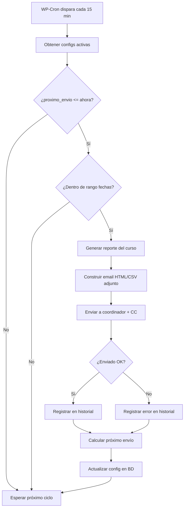

# Plan — Mejoras Reportes v3.0: Cambios de Columna/KPI + Automatización de Envíos

## Evaluación de factibilidad

Todas las solicitudes del cliente son **técnicamente viables** dentro del plugin actual. Se dividen en dos bloques: (A) cambios en la vista del informe general y (B) nuevo módulo de automatización.

---

## BLOQUE A — Cambios en el Informe General

### A1. Reemplazar columna "Estado de Alerta" por "Último Acceso"

**Ubicación actual:** Líneas 598-599 en `reportes.php` — `<th>...Estado de Alerta...</th>`

**Cambio:**
- Reemplazar el header `<th>Estado de Alerta` por `<th>Último Acceso`
- Reemplazar el `<td>` que muestra el badge de alerta (líneas 646-647) por la fecha de último acceso formateada
- El dato `ultimo_acceso_unix` ya está disponible en la query del informe general (línea 168)
- Aplicar el mismo formato usado en la vista de accesos: "Nunca" si es 0, o `date_i18n('d-m-Y H:i', ...)` si tiene valor
- El `data-sort-value` cambia de `$alerta_sort` al timestamp unix para permitir ordenamiento cronológico

**Riesgo:** Bajo. Es un cambio de presentación, no de datos.

---

### A2. Redefinir KPI "Alumnos en Riesgo"

**Cálculo actual (líneas 547-548):**
```php
if ((time() - $al['ultimo_acceso_unix']) / DAY_IN_DAYS > 7) {
    $alumnos_criticos++;
}
```
Solo cuenta alumnos con >7 días de inactividad que sí han ingresado.

**Nuevo cálculo solicitado:**
Un alumno está "en riesgo" si cumple **cualquiera** de estas condiciones:
1. Progreso < 100% **Y** no se ha conectado en más de 7 días
2. Nunca ha ingresado (sin importar progreso)
3. Progreso < 50% (sin importar último acceso)

**Implementación:**
```php
foreach ($alumnos as $al) {
    $progreso = floatval($al['progreso']);
    $ultimo = intval($al['ultimo_acceso_unix']);
    $dias_inactivo = $ultimo > 0 ? (time() - $ultimo) / DAY_IN_SECONDS : PHP_INT_MAX;

    $en_riesgo = false;

    // Condición 1: Progreso < 100% y >7 días sin conexión
    if ($progreso < 100 && $dias_inactivo > 7) {
        $en_riesgo = true;
    }
    // Condición 2: Nunca ha ingresado
    if ($ultimo === 0) {
        $en_riesgo = true;
    }
    // Condición 3: Progreso < 50%
    if ($progreso < 50) {
        $en_riesgo = true;
    }

    if ($en_riesgo) $alumnos_criticos++;
}
```

**Nota importante:** Hay que evitar doble conteo. Un alumno puede cumplir varias condiciones pero se cuenta una sola vez (usando un flag booleano).

**Riesgo:** Bajo. Solo cambia la lógica de cálculo del KPI.

---

## BLOQUE B — Automatización de Envíos de Reportes

### Resumen de requerimientos del cliente

#### B1. Configuración de Coordinador por Curso
Campos solicitados:
| Campo | Tipo | Origen |
|---|---|---|
| Institución | Texto | Input manual |
| Nombre coordinador | Texto | Input manual |
| Correo coordinador | Email | Input manual |
| Curso asociado | Select | Cursos de Moodle (ya existen) |
| Frecuencia de envío | Select | Diario / Semanal / Mensual |
| Día de envío | Select | Depende de frecuencia (día de semana o día del mes) |
| Hora de envío | Time | HH:MM |
| Tipo de reporte | Select | Avance general / Calificaciones parciales / Último acceso |
| Copia interna (CC) | Email(s) | Input manual, múltiples separados por coma |
| Fecha de último reporte | Fecha | Calculado automáticamente |

#### B2. Límites de envío
- Fecha de inicio (desde cuándo empezar a enviar)
- Fecha de fin (hasta cuándo dejar de enviar)

#### B3. Panel de Programación de Envíos
Tabla con columnas:
- Curso | Institución | Coordinador | Frecuencia | Próximo envío | Estado | Acciones

Acciones por fila:
- Activar envío / Pausar envío
- Enviar reporte ahora
- Ver historial
- Editar correo
- Cambiar frecuencia

---

### Arquitectura técnica propuesta

#### Nuevas tablas en la BD de WordPress

```sql
-- Tabla: configuraciones de coordinador/curso
CREATE TABLE {wp_prefix}tm_reportes_config (
    id INT AUTO_INCREMENT PRIMARY KEY,
    institucion VARCHAR(255),
    nombre_coordinador VARCHAR(255),
    correo_coordinador VARCHAR(255),
    curso_id INT,                          -- ID del curso en Moodle
    curso_nombre VARCHAR(255),             -- Cache del nombre
    frecuencia ENUM('diario','semanal','mensual'),
    dia_envio VARCHAR(20),                 -- 'monday','tuesday',... o '1','15',... para mensual
    hora_envio TIME,                       -- 'HH:MM'
    tipo_reporte ENUM('general','notas','accesos'),
    copia_interna TEXT,                    -- emails separados por coma
    fecha_inicio DATE,                     -- límite de envío
    fecha_fin DATE,                        -- límite de envío
    activo TINYINT(1) DEFAULT 1,
    ultimo_envio DATETIME NULL,
    proximo_envio DATETIME NULL,
    creado_en DATETIME DEFAULT CURRENT_TIMESTAMP,
    actualizado_en DATETIME DEFAULT CURRENT_TIMESTAMP ON UPDATE CURRENT_TIMESTAMP
);

-- Tabla: historial de envíos
CREATE TABLE {wp_reportes_historial (
    id INT AUTO_INCREMENT PRIMARY KEY,
    config_id INT,
    curso_id INT,
    curso_nombre VARCHAR(255),
    coordinador VARCHAR(255),
    correo_destino VARCHAR(255),
    tipo_reporte VARCHAR(20),
    estado ENUM('enviado','fallido'),
    mensaje_error TEXT NULL,
    fecha_envio DATETIME DEFAULT CURRENT_TIMESTAMP,
    FOREIGN KEY (config_id) REFERENCES {wp_prefix}tm_reportes_config(id) ON DELETE CASCADE
);
```

#### Estructura de archivos propuesta

```
TM Capacitacion/Reportes/
├── reportes.php                  (archivo principal — orquestador)
├── includes/
│   ├── class-db.php              (gestión de tablas, CRUD configuraciones)
│   ├── class-scheduler.php       (lógica de WP-Cron, cálculo próximo envío)
│   ├── class-mailer.php          (generación y envío de reportes por email)
│   ├── class-admin-config.php    (UI: formulario de configuración de coordinadores)
│   └── class-admin-panel.php     (UI: panel de programación con acciones)
├── assets/
│   ├── css/admin-reportes.css
│   └── js/admin-reportes.js
```

#### Flujo de automatización con WP-Cron



#### Detalles de implementación por componente

**1. WP-Cron scheduling**
- Registrar evento recurrente `tm_reportes_cron_hook` con recurrencia personalizada de 15 minutos
- Hook activado en `register_activation_hook` del plugin
- Eliminado en `register_deactivation_hook`

**2. Cálculo de próximo envío**
```php
function calcular_proximo_envio($frecuencia, $dia_envio, $hora_envio, $fecha_inicio, $fecha_fin) {
    $ahora = current_time('timestamp');
    $hora_partes = explode(':', $hora_envio);
    
    switch ($frecuencia) {
        case 'diario':
            $proximo = strtotime('tomorrow ' . $hora_envio);
            break;
        case 'semanal':
            $proximo = strtotime('next ' . $dia_envio . ' ' . $hora_envio);
            break;
        case 'mensual':
            $proximo = strtotime(date('Y-m') . '-' . $dia_envio . ' ' . $hora_envio);
            if ($proximo < $ahora) {
                $proximo = strtotime('+1 month', $proximo);
            }
            break;
    }
    
    // Validar dentro de rango
    if ($fecha_inicio && $proximo < strtotime($fecha_inicio)) {
        $proximo = strtotime($fecha_inicio . ' ' . $hora_envio);
    }
    if ($fecha_fin && $proximo > strtotime($fecha_fin)) {
        return null; // Fuera de rango
    }
    
    return $proximo;
}
```

**3. Generación de reporte para email**
- Reutilizar `tm_reportes_obtener_datos_curso()` existente
- Para `general`: generar tabla HTML embebida en el email
- Para `notas`: generar CSV adjunto
- Para `accesos`: generar CSV adjunto

**4. Email HTML para reporte general**
```
Asunto: Reporte de Avance - [Nombre Curso] - [Fecha]
Cuerpo HTML:
  - Header con logo/institución
  - KPIs principales (alumnos total, en riesgo, promedio, avance)
  - Tabla resumida (RUT, Alumno, Progreso, Último Acceso)
  - Footer con fecha de generación
```

---

## Cambios al menú de administración

**Menú actual:**
- Rep. Moodle → Página única de reportes

**Menú propuesto:**
```
Rep. Moodle
├── Reportes          (página existente con mejoras A1/A2)
├── Configuración     (formulario B1: agregar/editar coordinadores)
├── Programación      (panel B3: tabla con acciones)
└── Historial         (log de envíos)
```

---

## Checklist de implementación

### Fase 1 — Cambios en informe general (rápido, bajo riesgo)
- [ ] A1: Cambiar columna "Estado de Alerta" → "Último Acceso" con fecha formateada
- [ ] A2: Recalcular KPI "Alumnos en Riesgo" con las 3 condiciones

### Fase 2 — Estructura de datos
- [ ] Crear tabla `tm_reportes_config` con todos los campos solicitados
- [ ] Crear tabla `tm_reportes_historial`
- [ ] Funciones CRUD para ambas tablas
- [ ] Activation hook para crear tablas automáticamente

### Fase 3 — UI de configuración
- [ ] Submenú "Configuración" con formulario de alta/edición de coordinadores
- [ ] Select de cursos desde Moodle (reutilizar `tm_reportes_obtener_cursos_moodle()`)
- [ ] Campos: institución, nombre, email, curso, frecuencia, día, hora, tipo reporte, CC, fechas límite
- [ ] Listado de configuraciones existentes con botón editar/eliminar

### Fase 4 — Motor de automatización
- [ ] WP-Cron: registrar hook + recurrencia 15 min
- [ ] Función principal del cron: iterar configs activas, evaluar próxima fecha
- [ ] Generación de reporte por tipo (HTML para general, CSV adjunto para notas/accesos)
- [ ] Envío de email con `wp_mail()` al coordinador + CC
- [ ] Registrar resultado en historial
- [ ] Actualizar `ultimo_envio` y `proximo_envio`

### Fase 5 — Panel de programación
- [ ] Submenú "Programación" con tabla de configs
- [ ] Columnas: Curso, Institución, Coordinador, Frecuencia, Próximo envío, Estado
- [ ] Acciones: Activar/Pausar, Enviar ahora, Ver historial, Editar, Cambiar frecuencia
- [ ] "Enviar ahora": genera y envía el reporte inmediatamente sin esperar al cron
- [ ] Submenú "Historial": tabla con log de envíos

### Fase 6 — Testing y validación
- [ ] Verificar que el cron se ejecuta correctamente
- [ ] Validar cálculo de próxima fecha para cada frecuencia
- [ ] Probar envío de email con reporte HTML
- [ ] Probar envío con CSV adjunto
- [ ] Verificar que respeta fechas límite (inicio/fin)
- [ ] Probar acciones del panel (activar/pausar/enviar ahora)
