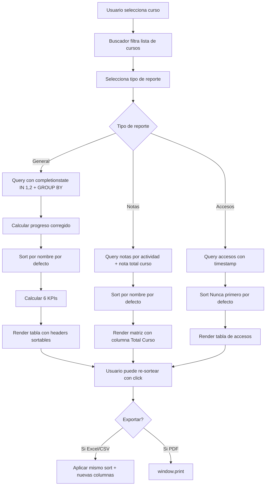

# Plan de Mejoras — Sistema de Reportes Moodle (reportes.php)

## Resumen de cambios solicitados por el cliente

| # | Requerimiento | Estado actual | Cambio |
|---|---|---|---|
| 1 | Buscador de curso (no solo select) | `<select>` plano | Buscador con filtrado en tiempo real |
| 2 | Ordenamiento automático + sortable por campo | Sin ordenamiento | JS client-side sort en todas las tablas |
| 3 | Reporte de calificaciones parciales con total del curso | Solo notas por actividad | Agregar columna "Total del Curso" |
| 4 | Progreso mal calculado en informe general | `completionstate = 1` | Cambiar a `IN (1, 2)` + `GROUP BY u.id` |
| 5 | Orden por defecto: informe general por nombre | Sin orden definido | Sort por nombre asc por defecto |
| 6 | KPIs: alumnos que ingresaron / nunca / con 100% | Solo 3 KPIs | Agregar 3 KPIs adicionales |
| 7 | Eliminar informe individual | Existe opción | Remover por completo |

---

## Análisis técnico detallado

### 1. Buscador de curso — Filtrado en tiempo real

**Problema actual:** El formulario usa un `<select>` estándar que lista todos los cursos. Si hay muchos, es difícil encontrar uno específico.

**Solución:** Mantener el `<select>` pero agregar un `<input type="text">` arriba que filtra las opciones del select en tiempo real con JavaScript.

```html
<!-- Estructura: -->
<input type="text" id="tm_curso_buscar" placeholder="Escriba para buscar curso..." 
       onkeyup="filtrarCursos()" />
<select name="tm_curso_id" id="tm_curso_id">
  <!-- options existentes -->
</select>
```

```javascript
function filtrarCursos() {
    var input = document.getElementById('tm_curso_buscar');
    var filter = input.value.toUpperCase();
    var select = document.getElementById('tm_curso_id');
    var options = select.getElementsByTagName('option');
    
    for (var i = 0; i < options.length; i++) {
        var txt = options[i].textContent || options[i].innerText;
        options[i].style.display = (txt.toUpperCase().indexOf(filter) > -1) ? '' : 'none';
    }
}
```

**Ventajas:** No requiere librerías externas, compatible con el formulario POST existente, funciona en el admin de WordPress.

---

### 2. Fix del cálculo de progreso — Bug crítico

**Problema:** El progreso nunca llega al 100% porque:

**Bug A — `completionstate`:**
```sql
-- ACTUAL (incorrecto):
WHERE cmc.completionstate = 1

-- CORREGIDO:
WHERE cmc.completionstate IN (1, 2)
```

En Moodle, `completionstate` tiene estos valores:
- `0` = Incomplete (no completado)
- `1` = Complete (completado)
- `2` = Complete_pass (completado con aprobación)
- `3` = Complete_fail (completado pero reprobado)

El código actual solo cuenta estado 1, ignorando el estado 2 (aprobado). Si una actividad requiere nota de aprobación, se marca como estado 2 y no se cuenta.

**Bug B — Duplicados por múltiples métodos de enrolamiento:**
Un alumno puede estar enrolado por más de un método (manual + cohort + self). El JOIN produce filas duplicadas.

**Fix:**
```sql
-- Agregar al final del WHERE:
GROUP BY u.id
```

Esto afecta la query del bloque `general` (línea 134-155) y requiere que el `GROUP BY` funcione con las columnas seleccionadas. Las subqueries son independientes por usuario así que se mantienen.

---

### 3. Columnas sortables en todas las tablas

**Enfoque:** JavaScript client-side (sin recarga de página).

**Implementación:**
1. Agregar clase `sortable` a cada `<th>` clickable
2. Agregar atributo `data-sort-key` con el identificador del campo
3. JS que captura click en `.sortable`, lee el `data-sort-key`, y reordena las filas `<tr>` del `<tbody>`
4. Indicadores visuales ▲ (asc) y ▼ (desc) en el header activo

**Orden por defecto (aplicado al renderizar la tabla en PHP):**

| Reporte | Orden por defecto |
|---|---|
| Informe General | Nombre del alumno (A-Z) |
| Calificaciones Parciales | Nombre del alumno (A-Z) |
| Últimos Accesos | Nunca ha ingresado primero, luego por fecha (más reciente primero) |

```javascript
// Esquema general de sorting
function sortTable(table, columnIndex, direction, valueType) {
    var tbody = table.querySelector('tbody');
    var rows = Array.from(tbody.querySelectorAll('tr'));
    
    rows.sort(function(a, b) {
        var aVal = a.cells[columnIndex].dataset.sortValue || a.cells[columnIndex].textContent.trim();
        var bVal = b.cells[columnIndex].dataset.sortValue || b.cells[columnIndex].textContent.trim();
        
        // Comparación numérica o string según valueType
        if (valueType === 'number') {
            return direction === 'asc' 
                ? parseFloat(aVal) - parseFloat(bVal)
                : parseFloat(bVal) - parseFloat(aVal);
        }
        return direction === 'asc'
            ? aVal.localeCompare(bVal)
            : bVal.localeCompare(aVal);
    });
    
    rows.forEach(function(row) { tbody.appendChild(row); });
}
```

**Para el reporte de accesos** — el "Nunca" se ordena usando un `data-sort-value="0"` en el `<td>` cuando es "Nunca", y el timestamp Unix cuando tiene fecha. Esto asegura que los "Nunca" queden arriba.

---

### 4. Total del Curso en reporte de notas

**Cambio en `tm_reportes_obtener_datos_curso()` — vista `notas`:**

Agregar una cuarta query (o extender la query de alumnos) para traer la nota final del curso:

```sql
SELECT gg.userid, gg.finalgrade 
FROM {$prefix}grade_grades gg
JOIN {$prefix}grade_items gi ON gi.id = gg.itemid
WHERE gi.courseid = ? AND gi.itemtype = 'course'
```

 Cruzar en PHP:
```php
$alumno['nota_total_curso'] = isset($notas_totales[$userid]) 
    ? round($notas_totales[$userid], 1) 
    : '-';
```

**En la tabla HTML:** Agregar `<th>Total del Curso</th>` al final y renderar `$alumno['nota_total_curso']`.

**En el export CSV:** Agregar la columna en el header y en cada fila.

---

### 5. Nuevos KPIs en informe general

Agregar 3 nuevos KPI boxes junto a los existentes (Promedio General, Avance del Grupo, Alumnos en Riesgo):

```php
// Calcular al iterar sobre $alumnos:
$total_ingresaron = 0;
$total_nunca = 0;
$total_100 = 0;

foreach ($alumnos as $al) {
    if ($al['ultimo_acceso_unix'] == 0) {
        $total_nunca++;
    } else {
        $total_ingresaron++;
    }
    if ($al['progreso'] == 100) {
        $total_100++;
    }
}
```

**KPIs a mostrar (6 totales en 2 filas o grid responsivo):**

| KPI | Color | Cálculo |
|---|---|---|
| Promedio General | Azul | `round($suma_notas / $total_alumnos, 1)` |
| Avance del Grupo | Verde | `round($suma_progreso / $total_alumnos, 1)%` |
| Alumnos en Riesgo | Rojo | Contador existente |
| Alumnos que Ingresaron | Verde | `$total_ingresaron` |
| Nunca han Ingresado | Rojo | `$total_nunca` |
| Progreso 100% | Verde oscuro | `$total_100` |

---

### 6. Orden por defecto — Informe general por nombre

En el PHP, antes de renderizar la tabla del informe general, ordenar `$alumnos`:

```php
usort($alumnos, function($a, $b) {
    $nombreA = strtolower($a['nombre'] . ' ' . $a['apellido']);
    $nombreB = strtolower($b['nombre'] . ' ' . $b['apellido']);
    return strcmp($nombreA, $nombreB);
});
```

---

### 7. Eliminar informe individual

Remover:
- Opción `<option value="individual">` del `<select>` de tipo de reporte (línea ~379)
- Bloque `elseif ($vista_seleccionada === 'individual')` completo (líneas 495-529)
- En la función `tm_reportes_obtener_datos_curso()`: cambiar `$vista === 'general' || $vista === 'individual'` a solo `$vista === 'general'` (línea 133)
- En `tm_reportes_exportar_excel()`: la validación `in_array($vista_seleccionada, ['notas', 'accesos'])` ya no incluye 'individual', así que está OK
- CSS de `.ficha-alumno` y `.ficha-header` (se pueden dejar o limpiar)

---

### 8. Actualizar export Excel

**Para reporte de notas:**
- Agregar `'Total del Curso'` al array de cabeceras
- Agregar el valor en cada fila del CSV

**Orden en exports:**
- Aplicar el mismo `usort` por nombre que en pantalla para notas y general
- Para accesos, ordenar por `ultimo_acceso_unix` ASC (Nunca=0 primero)

---

## Diagrama de flujo



---

## Archivos a modificar

| Archivo | Cambios |
|---|---|
| `TM Capacitacion/Reportes/reportes.php` | Todos los cambios (único archivo del plugin) |

## Riesgos y consideraciones

1. **`GROUP BY u.id` con subqueries:** Las subqueries correlacionadas deben seguir funcionando con GROUP BY. En MySQL/MariaDB con `ONLY_FULL_GROUP_BY`, hay que verificar que todas las columnas no agregadas estén en el GROUP BY. Alternativa: usar `DISTINCT u.id` en el JOIN o cambiar la estrategia a una query sin subqueries.

2. **Performance del sorting client-side:** Con listas grandes de alumnos (500+), el sort JS puede ser lento. Solución: el sort es aceptable hasta ~1000 filas. Si hay cursos más grandes, considerar paginación futura.

3. **Sensibilidad de la query de progreso:** Cambiar `completionstate = 1` a `IN (1, 2)` cambiará los resultados de TODOS los reportes. Esto es el comportamiento correcto, pero los clientes pueden notar cambios en números existentes.

4. **El informe individual se elimina:** Si algún usuario tenía bookmarks o accesos directos a `tm_tipo_reporte=individual`, no encontrará la vista. El fallback natural es mostrar el informe general.
